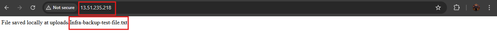
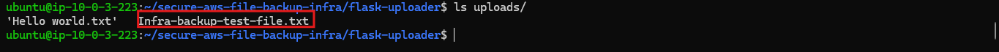
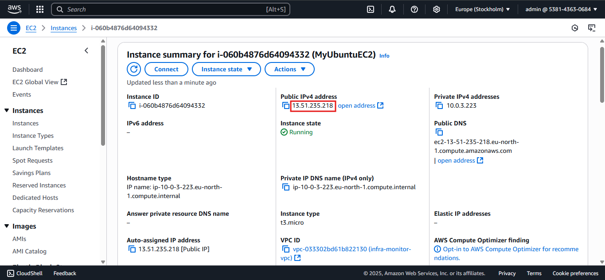
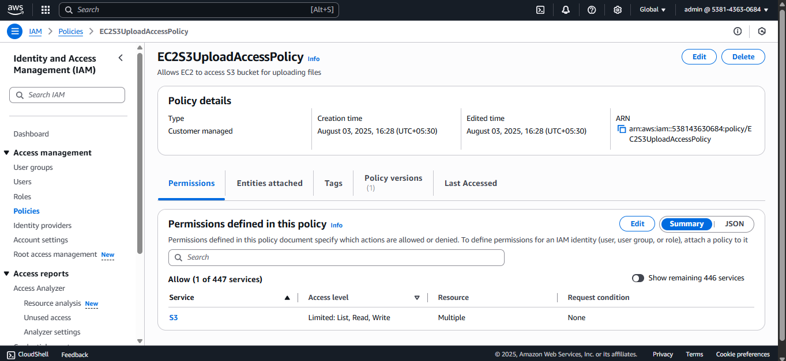
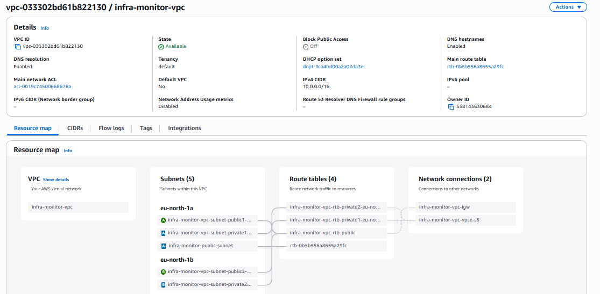
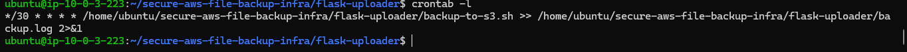
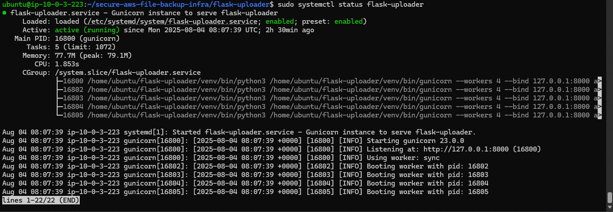
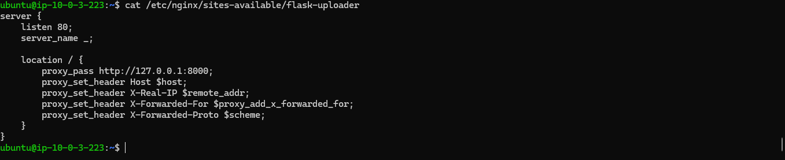

# Secure AWS File Backup Infrastructure

This project demonstrates how to build a secure, automated file backup system using AWS infrastructure and a simple Flask web interface.

Users can upload files through a web UI hosted on an EC2 instance. These files are first stored locally on the EC2 machine and later automatically backed up to Amazon S3 every 30 minutes using a cron job and bash script. The entire infrastructure is secured using IAM roles, custom policies, and network configurations.

---

## 🌐 Technologies Used & Why

| Technology               | Purpose                                  | Reason for Use                                                    |
| ------------------------ | ---------------------------------------- | ----------------------------------------------------------------- |
| **AWS EC2**              | Hosts the Flask web app and cron job     | Provides scalable compute with network-level control              |
| **Amazon S3**            | Stores backup copies of uploaded files   | Reliable and scalable object storage for long-term data retention |
| **IAM Roles & Policies** | Securely grant S3 access to EC2 instance | Follows least-privilege principle using instance profiles         |
| **VPC & Subnets**        | Network segmentation and security        | Isolates EC2 from public exposure and enforces IP rules           |
| **Security Groups**      | Control traffic to/from EC2              | Acts like a firewall for fine-grained access control              |
| **Flask**                | Web framework for file uploads           | Lightweight and easy-to-integrate Python framework                |
| **Gunicorn + systemd**   | Runs Flask as a production service       | Provides robust and manageable deployment                         |
| **Nginx**                | Reverse proxy for Flask app              | Handles incoming HTTP traffic and forwards to Gunicorn            |
| **Bash + Cron**          | Automates backup to S3 every 30 minutes  | Simple and effective automation for periodic tasks                |

---

## 📂 Project Structure

```bash
secure-aws-file-backup-infra/
├── flask-uploader/
│   ├── app.py                  # Flask web app
│   ├── uploads/                # Folder storing uploaded files locally
│   ├── backup-to-s3.sh         # Bash script to sync to S3
│   ├── backup.log              # Output from cron job
│   └── venv/                   # Python virtual environment (ignored)
├── flask-uploader.service      # systemd service for Gunicorn
├── nginx-config.txt            # Nginx configuration for reverse proxy
├── screenshots/                # Project screenshots
├── README.md                   # This file
├── .gitignore                  # Ignore venv/, __pycache__/, etc
```

---

## 🚀 How It Works

1. **User uploads file** → Flask app saves it in `/uploads`
2. **Every 30 minutes** → `cron` runs `backup-to-s3.sh`
3. **Script syncs uploads/** → `uploads-backup/` folder in S3
4. **IAM Role** on EC2 allows secure access to S3 bucket

---

## 📸 Screenshots

| Description                     | Screenshot                                  |
| ------------------------------- | ------------------------------------------- |
| Flask upload form               |                |
| Upload success message          |          |
| EC2 uploads folder after upload |      |
| S3 bucket showing backup folder |        |
| EC2 instance dashboard          |  |
| IAM role & policy for S3 access |         |
| VPC and subnets configuration   |              |
| Crontab job listing             |           |
| systemd Gunicorn service status |          |
| Nginx configuration preview     |    |

---

## 🛡️ Security Measures

* EC2 only has HTTP and SSH open via Security Groups
* IAM policy only allows uploading to S3 (not deleting or listing)
* Backups are one-directional: EC2 → S3 only
* AWS best practices applied for isolation and access

---

## 🧪 Testing

1. Upload a file via the web interface
2. Ensure the file appears in `/uploads/`
3. Wait for 30 minutes or run `bash backup-to-s3.sh`
4. Check the `uploads-backup/` folder in S3

---
